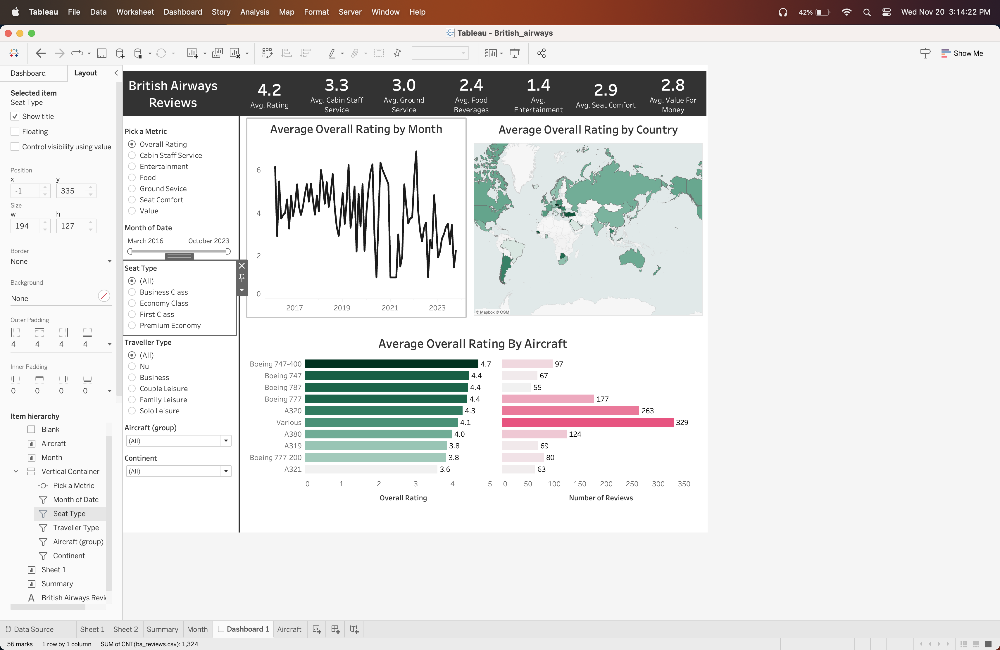

British Airways Reviews Dashboard: Sentiment Analysis & Insights

Features

Key Metrics:
Average ratings for cabin staff service, ground service, entertainment, food, seat comfort, and value for money.

Trend Analysis:
Monthly trends in cabin staff service ratings over several years.

Geographical Insights:
Country-wise performance visualization using a color-coded map.
Aircraft Analysis:
Comparison of service ratings across aircraft types, along with the number of reviews.

Interactive Filters:
Seat Type: Economy, Business, First Class, and more.
Traveler Type: Business, Family Leisure, Couple Leisure, Solo.
Aircraft Group: Specific aircraft types.
Date Range: Reviews from March 2016 to October 2023.

Tools and Technologies
Tableau:
Used for creating the interactive dashboard and visualizations.
Data Source:
British Airways customer reviews dataset (source not included for privacy reasons).

How to Use
Open the Tableau workbook file (.twb or .twbx) in Tableau Desktop or Tableau Reader.
Explore the dashboard by applying filters to analyze specific subsets of data.
Use the map, bar charts, and line graphs to derive actionable insights on service quality trends.

Project Purpose
This dashboard is designed to:

Provide stakeholders with a comprehensive understanding of customer feedback for British Airways.
Highlight areas of excellence.
Identify opportunities for improvement in service delivery.
Repository Contents
Dashboard.twbx: Tableau packaged workbook file.
dashboard_screenshot.png: Screenshot of the dashboard.
README.md: Documentation for the project.

Contact

For questions, suggestions, or collaborations, feel free to reach out!

